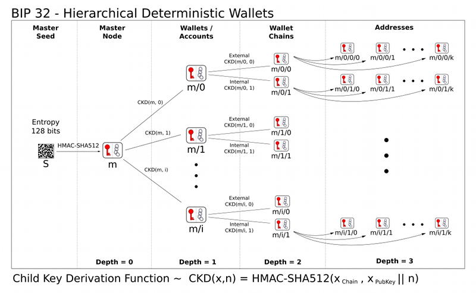

# BIP-32 (Bitcoin Improvement Proposal 0032)

Author of the Proposal: [Pieter Wuille](https://github.com/sipa)

Documented By: [Abhijay Rajvansh](https://www.abhijayrajvansh.com/)

BIP-32 (Bitcoin Improvement Proposal 32) is a standard for creating hierarchical deterministic (HD) wallets in Bitcoin and other cryptocurrencies. HD wallets allow users to generate a tree of private and public keys from a single master seed, making it easier to manage multiple addresses without needing to back up each key individually.

### Key Concepts of BIP-32:

1. **Master Seed**: The starting point, usually a 12 or 24-word mnemonic phrase, used to generate all the keys in the wallet.
2. **Master Private Key (m)**: Derived from the master seed, this is the root private key from which all other private keys in the wallet can be generated.
3. **Key Derivation**: A process to generate child keys from a parent key. BIP-32 defines how keys are derived from the master key using a combination of a private key, public key, and a chain code (additional data to add randomness and security).
4. **Hierarchical Structure**: Keys are organized in a tree structure, allowing for different levels of key derivation. Each level can represent different accounts, purposes, or other distinctions.
5. **Public and Private Keys**: BIP-32 supports the generation of both private and public keys. Importantly, child public keys can be derived from a parent public key without

## Derivation:

